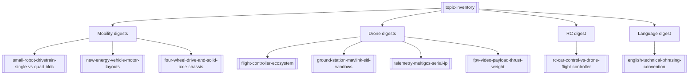

# DeepSeek Into the Unknown Digest

**What this is:** A **Chinese-language digest** of a long DeepSeek shared chat (exported PDF *Into the Unknown*, ~320 pages). Raw excerpts live under `raw/articles/` (`topic-inventory.md`, `mobility/`, `drones/`, `rc/`, `language/`); each companion **summary** below links back to the digest article for detail.

## Scope of the corpus

Topics span **small robot drivetrains**, **NEV motor layouts**, **4WD / solid-axle chassis**, **drone flight stacks (Betaflight / INAV / ArduPilot / PX4)**, **GCS / MAVLink / SITL on Windows**, **telemetry & serial servers & multi-GCS**, **FPV / video switching / payload & TWR**, **RC car vs drone control philosophy**, and a **short English usage note**.

## Map to summaries

## How to use in this wiki

- Prefer **summaries** for quick orientation; open the matching **raw** file for the full digest text.  
- Treat content as **second-hand AI chat**: verify critical design decisions against primary datasheets and manuals.

## See also

- [[LLM Wiki Knowledge Base Pattern]] — how this vault compiles sources in general.  
- [[readme]] — original repo README summary.
