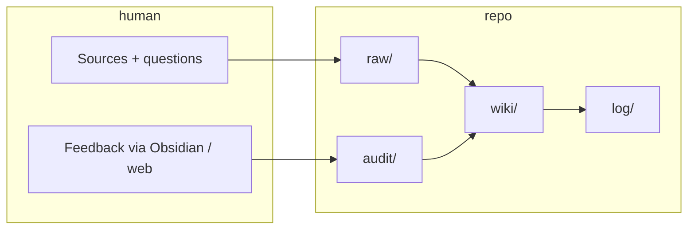

# LLM Wiki Knowledge Base Pattern

**Self-compiling wiki:** instead of RAG (re-retrieving raw docs on every question), an agent **writes durable** cross-linked pages under `wiki/` so knowledge **compounds** across sessions.

## How it differs from RAG

| RAG-style | LLM wiki pattern |
|-----------|------------------|
| Retrieve chunks per query | **Compile** once (or incrementally) into structured pages |
| Context ephemeral | `wiki/`, `log/`, `outputs/queries/` persist |
| Hard to audit mistakes | **`audit/`** holds anchored human corrections |

## Five operations

Every serious change should log a line in `log/YYYYMMDD.md` (`## [HH:MM] <op> | …`).

1. **`compile`** — Restructure `wiki/` (splits, merges, rebuild `wiki/index.md`).
2. **`ingest`** — New material in `raw/` → summary + concept/entity updates + index.
3. **`query`** — Answer from `wiki/` with inline citations to existing pages (Obsidian-style double-bracket links); optional `outputs/queries/` then **promote** durable answers.
4. **`lint`** — `lint_wiki.py`: dead links, orphans, index coverage, audit shape, etc.
5. **`audit`** — Resolve YAML-frontmatter feedback files; move to `audit/resolved/` with `# Resolution`.

## Tooling loop

Shared **TypeScript** (`audit-shared/`) keeps audit files identical whether filed from **`plugins/obsidian-audit/`** or **`web/`**.

## Lineage

Popularized in spirit by [[Andrej Karpathy]]’s public gist; this repo is one concrete tooling layout (see [[summaries/readme]]).

## See also

- [[Obsidian]] — typical IDE for the vault
- [[summaries/readme]] — full README-derived detail
