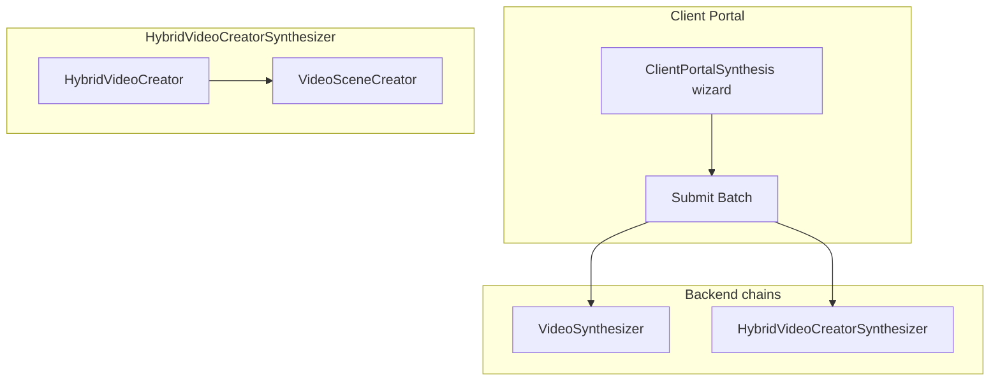

# PathLLM Client Portal and Hybrid Video Chain

**Client Portal** (PathLLM.ai / Forty-Two) is the **external wizard** where users set scope, structure, and output options and submit synthesis batches; **HybridVideoCreatorSynthesizer** is a **backend chain** that **mixes portal inputs with mined or video-analysis content** and fills gaps with **generated scenes**.

## Client portal surface

- Modeled under `components/external-component/client-portal/`.
- **`ClientPortalSynthesis`**: wizard for **request scope**, **structure**, **output settings**, and **“Submit Batch”** to start backend chains.
- JSON definitions tie the wizard to domain terms (`SynthesisBatch`, `Request`, `Policy`, `Storyboard`, `Storyline`) and list **triggers** such as `VideoSynthesizer`, `HybridVideoCreatorSynthesizer`, `StorySynthesizer`, `SegmentRemixSynthesizer`.
- **Structure mode** routing (standard vs storyboard vs story-only vs remix) is a **business rule** on the component; the exact API branch that picks one chain over another is still flagged for canonicalization in the same metadata files.

## Hybrid chain architecture

**`HybridVideoCreatorSynthesizer`** runs two sub-chains in order:

1. **`HybridVideoCreator`** — loads an existing **`Video`** with scope, request, optional storyboard; assigns **pattern** (storyboard-driven vs autonomous); **assembles** the video token (verbs, segments, hybrid assembly from a unified candidate pool).
2. **`VideoSceneCreator`** — **scene-level generation** (e.g. Gemini Veo, optional Runway base shots) for content **not** satisfied from existing material.

**Portal mapping** (from chain metadata): **Synthesis** tab, **Submit Batch**, when **storyboard is enabled with per-segment constraints**. **`VideoSynthesizer`** is described as the more **standard** path when storyboard is off or not driving per-segment locks.

**Runtime prerequisite:** hybrid flow expects a **Video already persisted** before `VideoInputResolver` runs; the operator skill doc calls out scope, segment imagery, and storyboard modes for NEO runs.

## Documentation posture

- **Portal:** contracts and engineering notes in-repo; **no** shipped end-user manual — product UI/help may live in another repo.
- **Hybrid:** **`.claude/skills/run-hybrid-video-creator-synthesizer/SKILL.md`** is the practical **runbook** (auth, service registry, `videoId`, monitoring, verification).

## Relationship to other concepts

- [[Forty-Two]] — monorepo / platform context for these definitions.

## Open questions

- Exact **API condition** that selects `HybridVideoCreatorSynthesizer` vs `VideoSynthesizer` vs other triggers for each structure mode (called out as needing canonicalization in source JSON).
- Whether a **master client-portal pipeline map** will be added under `docs/ideas/` or elsewhere.

## Sources

- [[summaries/usage-guide-clientportal-hybrid-chain]] — (2026-05-09) Cursor export inventorying portal vs hybrid docs.
